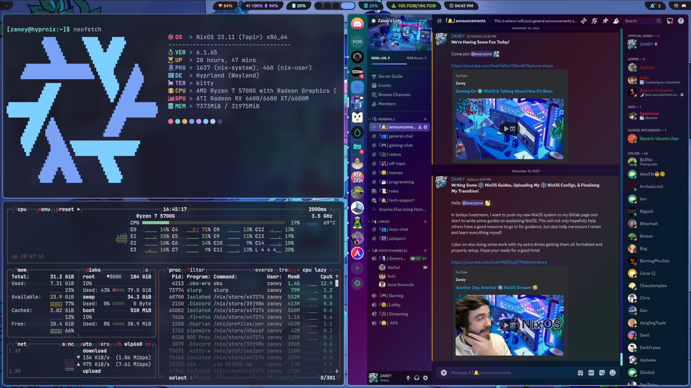

# ZaneyOS 🟰 Best ❄️ NixOS Configs

ZaneyOS is a way of reproducing my configuration on any NixOS system. This includes the wallpaper, scripts, applications, config files, and more. *Please remember to change username and hostname in flake.nix.*



## What Is NixOS

NixOS is a Linux distribution known for its unique approach to package management and system configuration. It uses the Nix package manager, which is based on a purely functional approach to managing software and system configurations.

In NixOS, the entire operating system configuration is described declaratively in a configuration file, allowing for reproducibility and easy rollbacks. This means that changes to the system can be tracked and reversed, making it robust and reliable for system administrators and developers.

## Why Choose NixOS

Choosing NixOS often depends on specific needs and preferences. Here are some reasons why people opt for NixOS:

### Declarative Configuration

NixOS employs a declarative approach to system configuration. This means the entire system configuration is defined in a single file, making it reproducible and easier to manage. Changes are tracked and can be rolled back if needed.

### Functional Package Management

The Nix package manager ensures that each package and its dependencies are isolated and managed separately. This prevents conflicts between different versions of software and enables easy rollbacks to previous versions.

### Reproducibility

NixOS allows for consistent and reproducible environments, critical in development, testing, and deployment scenarios. It's particularly valuable in DevOps and CI/CD pipelines where consistent environments are essential.

### Multiple Environments and Rollbacks 

With NixOS, it's possible to have multiple versions of the same software installed simultaneously without conflicts. This flexibility is especially useful for developers or those requiring different versions of software for various projects.

### Community and Customization

NixOS has an active community that contributes to its growth, sharing configurations, and offering support. Its customizable nature allows users to tailor their systems to their needs.

## Why Choose My Configuration?

I have gone through a lot of effort of making my configuration something that is simple to understand while remaining feature complete. My configuration is written as a NixOS Flake so you will need to be using NixOS. I will have a guide to replicating what I use down below.

## Explaining My Flake

My Flake controls where we are getting things from, allows me to define variables, as well as lets us choose which configuration (profile) we want. 

When you run the rebuild switch command from below it just sources the flake.nix that then sources default.nix and home.nix from the git repo. The hardware.nix is automatically generated with all the things you need and the default.nix imports other nix files containing certain aspects of the config that might change based on a profile. You'll notice some of these files have a Nix conditional statement so those settings only get used if that profile is selected. Additional profiles are being added and worked on, but you can always create another for your setup.

### How The Config Files Work

I am using home manager and as of now all configurations use the same home.nix configuration file. That is where all of the main configuration for stuff is.

All of the configuration files that we have being imported in the home.nix are stored in the folder config/home. You might have noticed something quite different about all of them... They are in a .nix format. These files are imported by home.nix. 

### This Makes Theming Incredible

Having the configuration files as a .nix file that I have creating the home files allows me to have variables passed into them. This allows me to use Nix Colors, **a phenomenal tool in NixOS**, to define a base16 colorscheme and let the user change it in the flake and have all the programs change upon rebuild. *Do note that some programs like SwayNotificationCenter may require a relaunch to show changes.*

Themes you have available for you to set in the flake.nix are available [here](https://github.com/tinted-theming/base16-schemes). Just take off the .yaml part of any of those names and use that as your theme variable.

Another cool thing I can do is have that theme the user set in the flake.nix used to generate a GTK theme as well! So when you change that one variable all you system programs will change upon a rebuild. I have included some fun scripts as well so definitely have some fun playing around with what you can do with my setup.

# Steps To Reproduce My System

- Enable flakes in your default configuration.nix by adding this:

```
# Enable Flakes and the new command-line tool
nix.settings.experimental-features = [ "nix-command" "flakes" ];
```

This file should be located at /etc/nixos/configuration.nix

- Ensure you have Git listed in your pkgs in the configuration.nix.
- Rebuild your system.
- Clone this repo.
- Then go into repo folder (stay in this folder)
- Change username, hostname, theme, and any other variables you may want under user information in flake.nix
- Ensure you have selected the proper profile in the flake as well. I use amd-desktop.
- Generate your hardware.nix like so:

```
nixos-generate-config --show-hardware-config > hardware.nix
```

- Run this command:

```
sudo nixos-rebuild switch --flake .
```

Now when you want to rebuild the configuration you have access to an alias called flake-rebuild that will rebuild the flake based of the flakeDir variable you set in flake.nix!

Hope you enjoy!
