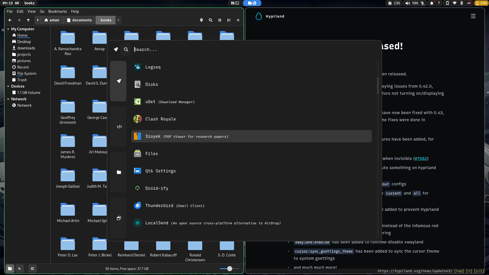

# Aman9das' Config

This is a simple way of reproducing my configuration on any NixOS system. This includes the wallpaper, scripts, applications, config files, and more. Based on [ZaneyOS](https://zaney.org/zaneyos/).



## 🍖 Requirements

- You must be running on NixOS.
- Must have installed using GPT & UEFI.
- Manually editing options.nix file in hosts/<yourhostname> folder.

### 🏇 Optimized Hyprland Workflow, Reliable GNOME Desktop, & Simple Yet Elegant Neovim

- Opinionated Hyprland setup for increased functionality and efficiency.
- GNOME Desktop for friends and family.
- Lazyvim configuration for editing productivity.

### 🖥️ Multi Host & User Configuration

- You can now define separate settings for different host machines and users!
- Easily specify extra packages for your users in the users/users.nix file.
- Easy to understand file structure where each host just has its generated hardware.nix file and option.nix file in a folder with the hostname as its title.


### 📦 How To Install Packages?

- You can search the [Nix Packages](https://search.nixos.org/packages?) & [Options](https://search.nixos.org/options?) pages for what a package may be named or if it has options available that take care of configuration hurdles you may face.
- To add a package there are the packages.nix files located in ./config/system and ./config/home folders. One is for programs available system wide and the other for your users environment only.
- You also have the option of easily adding packages to the option in the users/users.nix file for a specific user.

### 🙋 Having Issues / Questions?

- Please feel free to raise an issue on the repo, please label a feature request with the title beginning with [feature request], thank you!

## ⬇️ Install

### 📜 Script

This is the easiest and recommended way of starting out. The script is not meant to allow you to change every option that you can in the flake or help you install extra packages. It is simply here so you can get my configuration installed with as little chances of breakages and then fiddle to your hearts content!

Simply copy this and run it:

``` sh
nix-shell -p git curl
sh <(curl -L https://github.com/aman9das/zaneyos/-/raw/main/install-zaneyos.sh)
```

### 🦽 Manual

Run this command to ensure Git & Vim are installed:

``` sh
nix-shell -p git vim
```

Clone this repo & enter it:

``` sh
git clone https://github.com/aman9das/zaneyos.git
cd zaneyos
```

- *You should stay in this folder for the rest of the install*

Create the host folder for your machine(s)

``` sh
hostname="<your-desired-hostname>"
cp -r hosts/default hosts/$hostname
```

> **WARNING:** Edit hosts/$hostname/options.nix

Generate your hardware.nix like so:

``` sh
nixos-generate-config --show-hardware-config > hosts/$hostname/hardware.nix
```

Run this to enable flakes and install the flake replacing hostname with whatever you put in the hosts/<your-desired-hostname>/options.nix file:

``` sh
NIX_CONFIG="experimental-features = nix-command flakes"
sudo nixos-rebuild switch --flake .#hostname
```

Now when you want to rebuild the configuration you have access to an alias called flake-rebuild that will rebuild the flake based of the flakeDir variable you set in options.nix!

Hope you enjoy!
